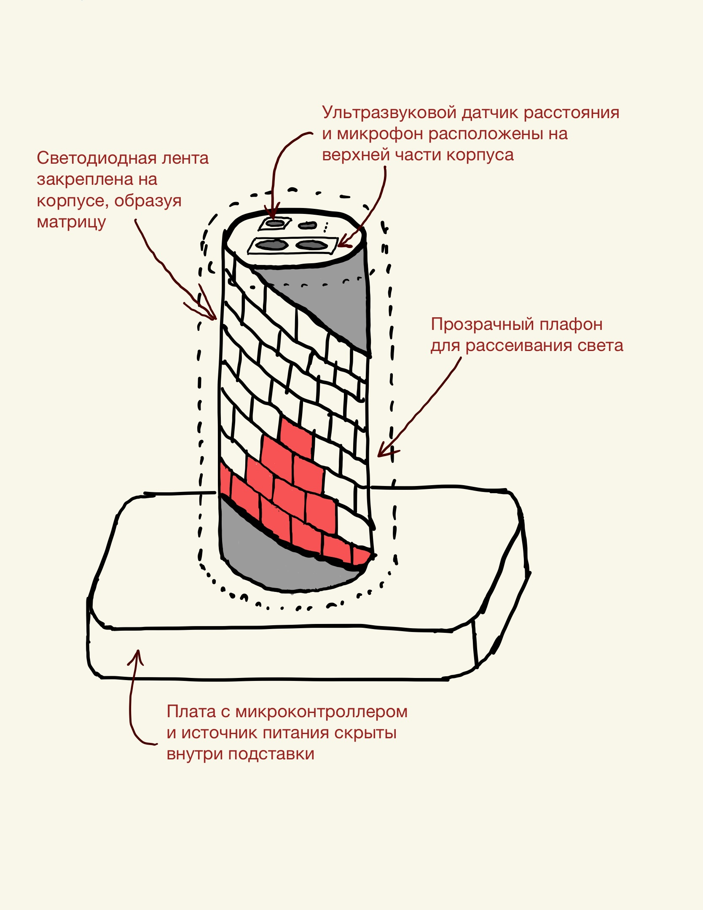
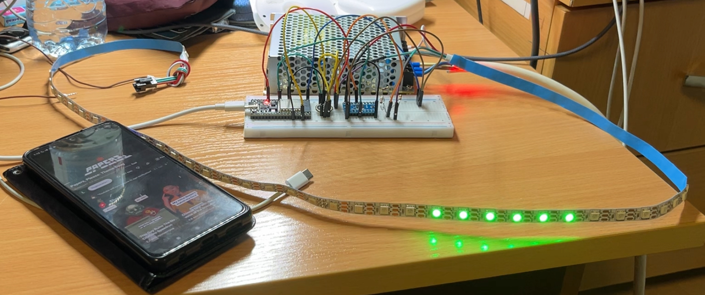
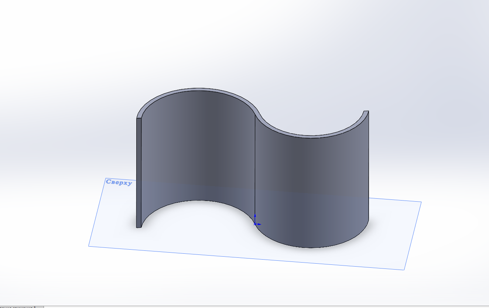
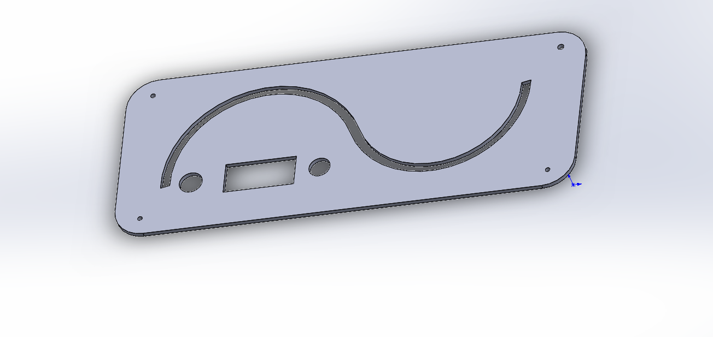
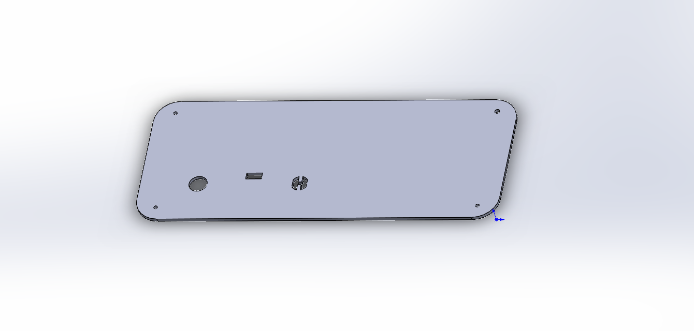
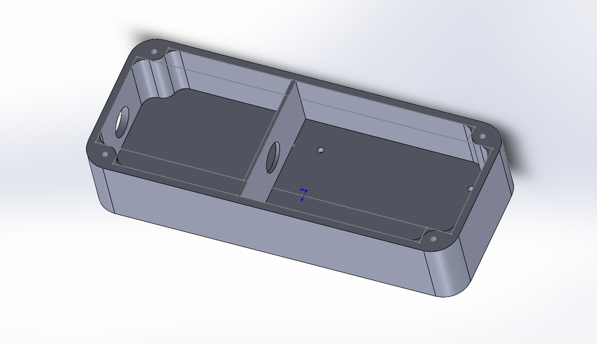
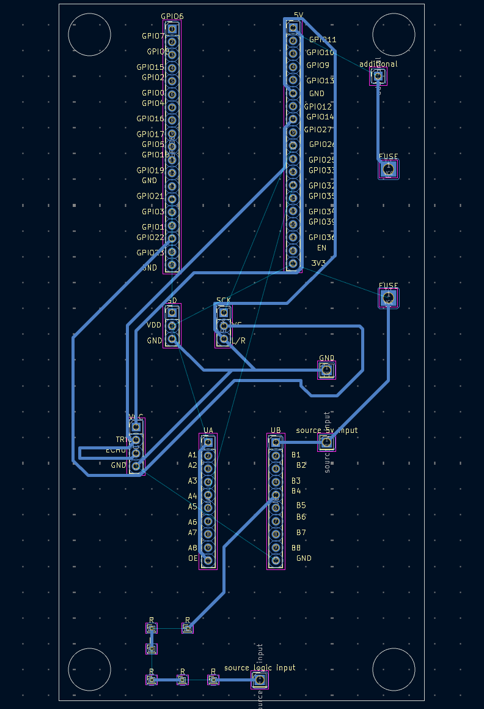

# Визуализатор звука с управлением жестами(светомузыка)

## Команда:

Косолапова Екатерина, Б01-401, kosolapova.ea@phystech.edu\
Скотников Антон, Б01-406, skotnikov.aa@phystech.edu\
Рябов Иван, Б01-406, riabov.ia@phystech.edu

## Идея
Мы хотели создать систему светомузыки с управлением жестами — устройства, способного в реальном времени анализировать входящий аудиосигнал, отображать спектр звука на адресной светодиодной ленте и переключать режимы визуализации мановением руки.

## Задачи
В ходе создания проекта стало очевидно, что полноценная разработка устройства есть задача непростая. На каждом этапе возникало множество вопросов, а также моменты, когда нужно было выбирать между разными вариантами решений. По мере работы некоторые элементы проекта пришлось переосмыслить и изменить. Поэтому, чтобы упростить представление плана, он будет изложен как последовательность лишь тех шагов, которые в итоге привели к конечному результату.

Процесс воплощения идеи в конечном счете разбился на достаточное количество этапов:

0. Подготовка примерного дизайна: эскизы, наброски.
1. Подготовка нужных компонентов: микроконтроллера ESP32 CP2102 38 pin, адресной светодиодной ленты WS2812B, блока питания(БП) 5В 10А, микрофона INMP441, трех резисторов по 80 Ом, преобразователя логических уровней TXS0108E, предохранителя OXION 0.5A и ультразвукового датчика расстояния HC-SR04.
2. Сборка первых прототипов на макетной плате: сначала был "подружен" на макетке микрофон и микроконтроллер, затем уже добавились БП, лента и датчик дальности.
3. 3D-моделирование и печать корпуса, подставки и поверхности.
4. Проектирование печатной платы.
5. Пайка всех компонентов.
6. Написание режимов работы светомузыки.

## Подготовка
В самом начале был подготовлен концептуальный эскиз нашего проекта:

:-------------------------:
Рис 1. Концептуальный эскиз

Часть компонентов(микрофон, ультразвуковой датчик) была взята на Фабрике, а лента, БП, преобразователь логических уровней и предохранитель были куплены самостоятельно.

## Сборка первых прототипов
На макетной плате был в конечном счете был собран первый рабочий прототип, пока без датчика дальности, который положил начало производству итоговой реализации нашего проекта:

:-------------------------:
Рис 2. Прототип светомузыки на макетной плате

## Моделирование и 3D-печать
Изначально, как видно на концептуальном эскизе, у нас была идея дизайна в виде цилиндрической поверхности, но впоследствии мы отказались от него в пользу чего-то менее стандартного. Мы остановились на поверхности в форме кривой:

:-------------------------:
Рис 2. Конечный дизайн, файл `surface.SLDPRT`

Все моделирование происходило в SolidWorks. Корпус, и как и поверхность, печатались на 3D-принтере, подставка же делалась из оргстекла и состоит из двух частей - чтобы лучше держались в ней микрофон, датчик дальности, а также чтобы на ней нормально стояла поверхность:

:-------------------------:
Рис 3. Подставка, верхняя часть, файл `cover_top_layer_final.SLDPRT`

:-------------------------:
Рис 4. Подставка, нижняя часть, файл `cover_bottom_final.SLDPRT`

:-------------------------:
Рис 5. Корпус, файл `korpus.SLDPRT`

## Разработка платы
Плата проектировалась в KiCad и изготавливалась на фрезерно-гравировальном станке Charly4U при помощи программы FlatCAM. Дизайн дорожек представлен ниже:

:-------------------------:
Рис 6. Разводка печатной платы

Для большего удобства распишу все подключения к пинам на плате:

| Пин      | к чему подключается |
|----------|---------------------|
| SCK      | GPIO_NUM_26         |
| L/R      | общая GND           |
| WS       | GPIO_NUM_22         |
| SD       | GPIO_NUM_21         |
| GND      | общая               |
| VDD      | 3V3                 |
| VCC      | 5V через FUSE       |
| UB       | source 5v input     |
| UA       | 3V3                 |
| A4       | GPIO_NUM_32         |
| B4       | резисторы           |
| TRIG     | ECHO                |
| OE       | UA                  |
| TRIG     | GPIO_NUM_14         |
| резисторы| source logic input  |

## Внутрянка

Покажем подробнее, что же находится внутри корпуса:

:-------------------------:
Рис 7. Обратная сторона печатной платы

:-------------------------:
Рис 8. Внутренность корпуса

## Программная часть
На данный момент тут представлены 3 файла:
* `fft_leds.ino` - здесь представлена первая реализация светомузыки - работы нашей адресной светодиодной ленты за счет разложения звукового сигнала по Быстрому преобразованию Фурье(БПФ);
* `fft_implementation.ino` - здесь показан код, показывающий наглядно работу нашего БПФ, на его основе была уже сделана реализация со светодиодами;
* `fft_visualisation.py` - код, который визуализирует наше БПФ, в формате понятного графика: по вертикальной оси представлена амлитуда сигнала, по горизонтальной - частоты, по которым сигнал раскладывается. Запускается непосредственно после `fft_implementation.ino`

